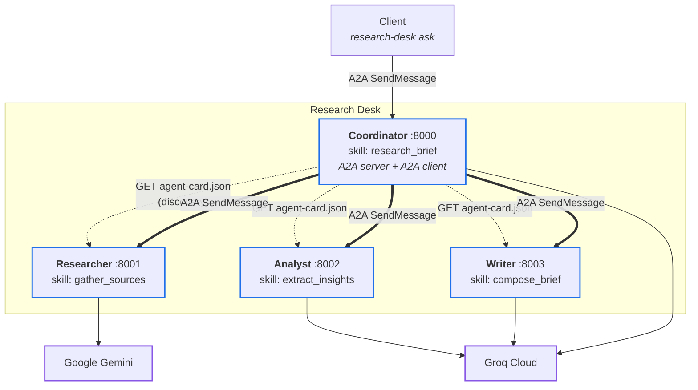
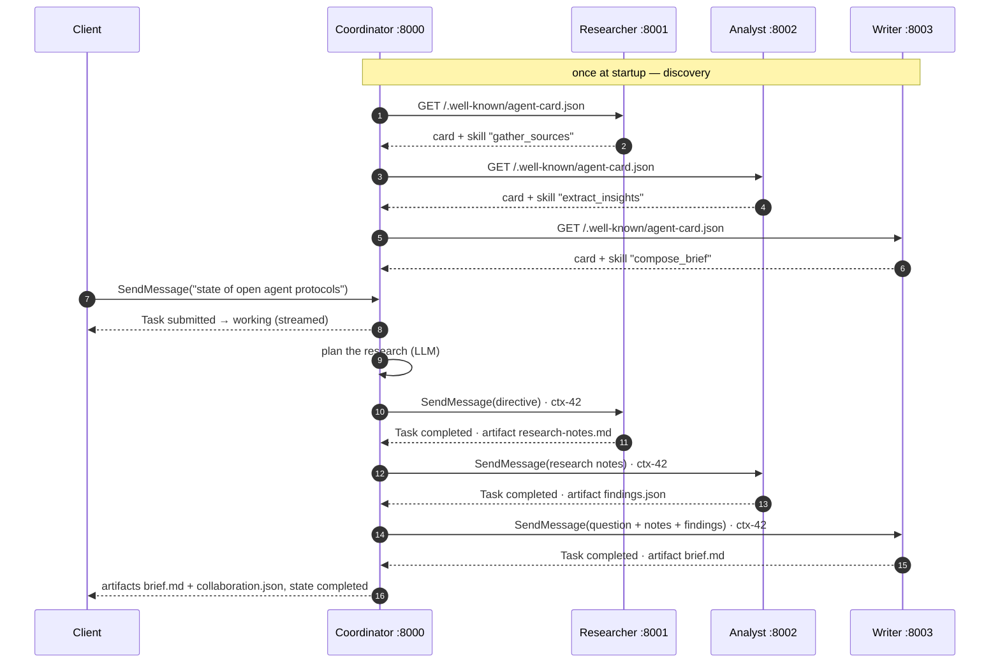

# Research Desk — an Agent2Agent (A2A) protocol demo

Four independent AI agents, each a separate service with its own identity, model
and skills, collaborating on a research brief over the **[Agent2Agent (A2A)
protocol](https://a2a-protocol.org/) v1.0**.

The agents are not classes calling each other inside one program. Each one is a
standalone HTTP server that publishes an **agent card**, and every hand-off is a
real JSON-RPC request across the network. Take one agent down and the others
notice; move a skill to a different host and routing follows it.

```
$ research-desk ask "the state of open agent interoperability protocols"

→ Coordinator v1.0.0 — research_brief

  [working  ] Discovering specialist agents
  [working  ] Discovered 3 agent(s): Researcher, Analyst, Writer
  [working  ] Planning the research
  [working  ] Delegating 'gather_sources' to Researcher
  [working  ] Researcher returned 1326 characters
  [working  ] Delegating 'extract_insights' to Analyst
  [working  ] Analyst returned 1927 characters
  [working  ] Delegating 'compose_brief' to Writer
  [working  ] Writer returned 2031 characters
  [artifact ] brief.md (2031 chars)
  [artifact ] collaboration.json (1 data part(s))
  [completed]
```

---

## What A2A is, and why it matters

A2A is an open protocol — originally from Google, now under the Linux Foundation
— for agents built by different teams, on different stacks, to work together.
It standardises four things:

| | |
|---|---|
| **Identity & capability** | An *agent card* at `/.well-known/agent-card.json` says who an agent is, where to reach it, and what skills it offers. |
| **Discovery** | Clients read that card instead of being hardcoded against an implementation. |
| **Interaction** | JSON-RPC methods — `SendMessage`, `GetTask`, `CancelTask` — carrying typed messages and parts. |
| **Task lifecycle** | Work is a *task* with observable state: `submitted → working → completed`, or `input-required`, `failed`, `canceled`. Results come back as *artifacts* attached to the task. |

The point is composition across boundaries. An in-process function call requires
one language, one deploy, one owner. An A2A call requires only that the other
side speaks the protocol — so a Python agent on Gemini can delegate to a Go agent
on some other model, owned by a different team, without either knowing anything
about the other's internals. This project is a small, honest instance of exactly
that shape.

## Architecture



Dotted arrows are discovery, thick arrows are delegated work. The coordinator is
both a **server** (to the client) and a **client** (to the specialists) — the
clearest demonstration of what the protocol enables.

Each agent runs on a **different model from a different vendor**, which is the
practical argument for A2A: heterogeneity is the normal case, not the exception.

## Agent flow



`ctx-42` is the coordinator's context id, propagated to every peer so a single
run is traceable across all four services from their logs alone.

## How A2A works here

| Concept | Where to look |
|---|---|
| **Identity** | [`cards.py`](src/research_desk/cards.py) — each agent's `AgentCard`: name, version, provider, and the URL it can be reached on. |
| **Capabilities** | The same cards declare `AgentSkill`s (id, description, tags, examples, I/O modes) and streaming support. |
| **Discovery** | [`protocol/discovery.py`](src/research_desk/protocol/discovery.py) — the coordinator is given peer *base URLs* only, fetches each card at startup, and indexes the skills it finds. `GET /agents` shows the result. |
| **Agent → agent requests** | [`protocol/client.py`](src/research_desk/protocol/client.py) — real JSON-RPC `SendMessage` calls. The coordinator imports no specialist code, only this client. |
| **Results** | Answers come back as **artifacts** on a task, not return values — so a caller can re-fetch them later with `GetTask`. |
| **Task lifecycle** | [`agents/base.py`](src/research_desk/agents/base.py) drives `submitted → working → completed`; model failures become `failed` with a readable message; a too-vague question returns `input-required` and is resumable on the same task. |
| **Structured communication** | The analyst publishes its findings twice — as text and as a typed `DataPart` — so the next agent consumes fields rather than re-parsing prose. |
| **Separation** | Four processes, four ports, four containers. The only thing crossing the boundary is the protocol. |
| **Orchestration** | [`agents/coordinator.py`](src/research_desk/agents/coordinator.py) — plans, routes **by skill id**, and degrades gracefully when a peer is missing. |

### Routing is by skill, not by address

The coordinator never says "call the thing on port 8002". It asks its registry
for whoever advertises `extract_insights`. Move that skill to another host,
change the port, or merge two specialists into one process, and the coordinator
follows without a code change — that is what discovery buys.

### Failure is part of the design

| What breaks | What happens |
|---|---|
| Analyst is down | Brief is written from research notes alone; the gap is recorded in `collaboration.json`. |
| Writer is down | Coordinator assembles a clearly-labelled raw brief instead of silently faking one. |
| Researcher is down | Task fails with an explanation — there is nothing to write about. |
| A model call fails | That agent's task moves to `failed`; the coordinator decides whether the pipeline survives. |
| A provider returns 429 | The LLM layer rotates to the next API key and retries. |

Every run publishes a `collaboration.json` artifact recording each hop — peer,
skill, task id, state, duration — so the protocol traffic is visible in the
response itself, not just in the logs.

## Project structure

```
src/research_desk/
├── cards.py            Agent cards: identity, skills, transport binding
├── config.py           Environment-driven settings; API-key pools
├── logging.py          Structured logs correlated by context_id / task_id
├── cli.py              serve · dev · ask · card
├── protocol/           The A2A layer — knows nothing about research
│   ├── server.py         Builds the ASGI app: JSON-RPC + card + /health
│   ├── client.py         Outbound delegation to a discovered peer
│   └── discovery.py      Fetches peer cards, indexes skills
├── agents/             The four agents
│   ├── base.py           Shared executor: task lifecycle → artifact
│   ├── researcher.py     · analyst.py · writer.py
│   ├── coordinator.py    Orchestrator: server *and* client
│   └── factory.py        Assembles one agent from configuration
└── llm/                Pluggable model backends
    ├── base.py           LLMProvider protocol
    ├── groq.py           · gemini.py · stub.py
    ├── _http.py          Shared retry + API-key rotation
    └── registry.py       "groq:llama-3.3-70b" → provider

tests/                  116 tests, no network or API keys required
├── conftest.py           Runs all four agents in-process over ASGI transport
├── test_collaboration_e2e.py   Full multi-agent runs, including failure modes
├── test_protocol_endpoints.py  Wire-level JSON-RPC and agent cards
└── test_discovery.py · test_agents.py · test_llm.py · test_cards.py · test_config.py
```

## Running locally

Requires Python 3.11+.

```bash
git clone https://github.com/mallahim01/a2a.git
cd a2a

python -m venv .venv
source .venv/bin/activate        # Windows: .venv\Scripts\activate
pip install -e ".[dev]"

cp .env.example .env             # optional — see below
```

Start all four agents (one process, four ports):

```bash
research-desk dev
```

Then, in another terminal:

```bash
research-desk ask "the state of open agent interoperability protocols"
```

**No API keys?** The demo runs fully offline with the stub provider — the
protocol behaviour is identical, only the prose is synthetic:

```bash
COORDINATOR_MODEL=stub:planner RESEARCHER_MODEL=stub:researcher \
ANALYST_MODEL=stub:analyst  WRITER_MODEL=stub:writer research-desk dev
```

To run agents as genuinely separate processes, one per terminal:

```bash
research-desk serve researcher     # :8001
research-desk serve analyst        # :8002
research-desk serve writer         # :8003
research-desk serve coordinator    # :8000
```

Other commands:

```bash
research-desk card http://127.0.0.1:8001   # inspect any agent's card
curl http://127.0.0.1:8000/health          # liveness
curl http://127.0.0.1:8000/agents          # what the coordinator discovered
pytest                                     # 116 tests, no keys needed
ruff check . && mypy                       # lint + strict type check
```

## Running with Docker

```bash
docker compose up --build
```

Four containers on one network — the deployment A2A is actually for. Only the
coordinator's port is published:

```bash
curl http://127.0.0.1:8000/agents
research-desk ask "how does WebAssembly change edge computing"
```

The same image runs any agent, chosen by the command:

```bash
docker build -t research-desk .
docker run -p 8002:8002 -e PORT=8002 --env-file .env research-desk serve analyst
```

`.env` is excluded from the build context by `.dockerignore` and injected only at
run time; the image contains no credentials and runs as a non-root user.

> **Note on `PUBLIC_URL`.** An agent card must advertise a URL its *callers* can
> reach. In `docker-compose.yml` the specialists advertise their service names
> (`http://analyst:8002/`) because they are only ever called from inside the
> network, while the coordinator advertises the published host address. Deploying
> elsewhere means setting `PUBLIC_URL` to the real hostname.

## Configuration

Everything is an environment variable; see [`.env.example`](.env.example).

| Variable | Default | Purpose |
|---|---|---|
| `COORDINATOR_MODEL` | `groq:llama-3.1-8b-instant` | Model per agent, as `<provider>:<model>` |
| `RESEARCHER_MODEL` | `gemini:gemini-3.5-flash` | Providers: `groq`, `gemini`, `stub` |
| `ANALYST_MODEL` | `groq:openai/gpt-oss-120b` | |
| `WRITER_MODEL` | `groq:llama-3.3-70b-versatile` | |
| `GROQ_API_KEY`, `…_2`, `…_3` | — | Ordered key pool; a 429 rotates to the next |
| `GOOGLE_API_KEY`, `…_2` | — | Same, for Gemini |
| `PEER_AGENT_URLS` | localhost peers | Comma-separated base URLs the coordinator discovers |
| `PUBLIC_URL` | derived | Absolute URL this agent advertises in its card |
| `PORT`, `HOST` | per agent | Bind address |
| `RESEARCHER_ENABLE_SEARCH` | `false` | Gemini Google Search grounding (needs a paid plan) |
| `LOG_FORMAT` | `console` | `console` or `json` |

Swapping a vendor is one variable — no code changes:

```bash
ANALYST_MODEL=gemini:gemini-3.5-flash research-desk serve analyst
```

## Example

Request, as raw protocol (the CLI does this for you):

```bash
curl -s http://127.0.0.1:8002/ \
  -H 'Content-Type: application/json' \
  -H 'A2A-Version: 1.0' \
  -d '{
        "jsonrpc": "2.0", "id": "1", "method": "SendMessage",
        "params": { "message": {
          "messageId": "m1", "role": "ROLE_USER",
          "parts": [{ "text": "WebAssembly at the edge" }]
        }}
      }'
```

> The `A2A-Version` header is how a v1.0 server tells a v1.0 client from a v0.3
> one. Omit it and the request is refused.

Response (abridged):

```json
{
  "jsonrpc": "2.0", "id": "1",
  "result": { "task": {
    "id": "60f22d9f-…", "contextId": "0504d01a-…",
    "status": { "state": "TASK_STATE_COMPLETED" },
    "artifacts": [{
      "name": "findings.json",
      "metadata": { "produced_by": "Analyst", "model": "groq:openai/gpt-oss-120b" },
      "parts": [
        { "text": "{ \"themes\": [ … ] }" },
        { "data": { "themes": [ … ], "risks": [ … ], "confidence": "medium" } }
      ]
    }]
  }}
}
```

And the collaboration record the coordinator returns alongside every brief:

```json
{
  "question": "the state of open agent interoperability protocols",
  "participants": ["Researcher", "Analyst", "Writer"],
  "protocol": "A2A JSON-RPC (SendMessage)",
  "hops": [
    { "agent": "Researcher", "skill": "gather_sources",   "state": "TASK_STATE_COMPLETED", "duration_ms": 10981 },
    { "agent": "Analyst",    "skill": "extract_insights", "state": "TASK_STATE_COMPLETED", "duration_ms": 2184 },
    { "agent": "Writer",     "skill": "compose_brief",    "state": "TASK_STATE_COMPLETED", "duration_ms": 1032 }
  ],
  "degradations": []
}
```

## Design decisions

**Use the official `a2a-sdk`, not a hand-rolled protocol.** A demo that invents
its own "A2A-like" JSON would prove nothing. The SDK is the specification's
reference encoding, so what runs here is the real wire format.

**The coordinator imports nothing from the specialists.** It is the constraint
that keeps the demo honest. Everything it knows about its collaborators arrives
at runtime in a card fetched over HTTP.

**Raw `httpx` for the LLM providers, not two vendor SDKs.** Each provider is
~60 readable lines. In a repo whose purpose is to be *read*, showing the actual
HTTP request beats hiding it behind a client library — and it keeps the project
to six direct dependencies.

**A stub provider is a first-class citizen.** It makes the whole system runnable
and fully testable with no credentials, so the 116 tests need no network and
anyone can clone and run in under a minute.

**The coordinator plans with an LLM but routes deterministically.** Model output
decides *what* to research; skill ids decide *who* does it. Routing stays
explainable and testable.

**Tests drive real agents over a real ASGI transport.** `tests/conftest.py` runs
all four applications in-process and wires the coordinator's HTTP client to them.
Same protocol stack, same code paths as Docker — only the socket is replaced.

## Limitations

This is a demonstration, and it is deliberately bounded:

- **In-memory task store.** Task state is lost on restart. The SDK ships a
  database-backed store; swapping it is a one-line change in `protocol/server.py`.
- **No authentication.** Endpoints are open. The agent card has `securitySchemes`
  for exactly this, and the SDK has interceptors for credentials — neither is
  wired up.
- **Discovery is configuration-seeded.** Peers come from `PEER_AGENT_URLS`; there
  is no registry service, no health-based failover, no dynamic membership.
- **JSON-RPC transport only.** The spec also defines gRPC and REST bindings.
- **`input-required` uses a length heuristic**, not a model judging the question.
- **No `CancelTask` support.** A single model call is not interruptible, so
  cancellation is explicitly rejected rather than silently ignored.
- **No caching, retry budgets, or cost tracking** across the agent graph.
- **The brief is only as good as the model.** No grounding is enabled by default,
  so output can be confidently wrong — it is a protocol demo, not a research tool.

## Future improvements

- More specialists (fact-checker, critic, translator) — each one is a new card
  and a new container, with no coordinator change beyond adding a pipeline stage
- Authentication and authorisation via the card's `securitySchemes` and SDK
  client interceptors
- Persistent task state with the SDK's database store, plus `CancelTask` and
  push-notification callbacks for long-running work
- A registry service for discovery at scale, with health-aware routing and more
  than one agent per skill
- OpenTelemetry tracing across agent hops — the SDK has a `telemetry` extra, and
  `context_id` is already the correlation key
- Parallel fan-out where stages are independent, instead of a strict pipeline
- Production deployment: TLS, per-agent autoscaling, rate limits, cost budgets

## Security

- **Secrets only ever come from the environment.** No key is hardcoded, logged,
  or written into an artifact; `.env` is git-ignored and excluded from the Docker
  build context. The image is built without credentials and receives them at run
  time.
- **Containers run as a non-root user** with no shell, from a slim base.
- **Key pools are a resilience feature, not a secret store.** For production,
  use a real secret manager (AWS Secrets Manager, Vault, Kubernetes secrets)
  rather than a `.env` file.
- **The demo endpoints are unauthenticated and must not be exposed publicly.**
  Before any real deployment: add auth via the agent card's `securitySchemes`,
  terminate TLS, and rate-limit — an open agent endpoint backed by a paid model
  API is a billing incident waiting to happen.
- **Agent output is untrusted input.** Text returned by one agent is fed to the
  next as a prompt, which is a prompt-injection path. A production system would
  validate and delimit inter-agent content rather than concatenating it.

## License

[MIT](LICENSE)
